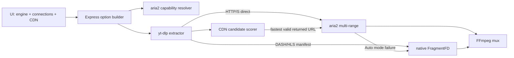

# Kế hoạch phát triển tối ưu tốc độ Bilibili

## Mục tiêu

Tăng tốc Bilibili VOD `.m4s` bằng nhiều HTTP Range connection, tự chọn CDN dựa trên phép đo thực tế, vẫn giữ yt-dlp làm extractor/mux engine và luôn có đường lui về native downloader.

## Quyết định cần xác nhận trước khi bắt đầu code

| Quyết định | Phương án mặc định | Hệ quả nếu đổi |
| --- | --- | --- |
| Phân phối aria2 | Hỗ trợ runtime portable cục bộ `.runtime/aria2/aria2c.exe`, `bin/aria2c.exe`, `EVERYVIDEO_ARIA2C`, rồi PATH; không commit binary | Tự bundle vào repository cần checksum, cập nhật release và rà soát giấy phép phân phối |
| Mặc định downloader | `Auto`: dùng aria2 cho HTTP(S) direct nếu có, native nếu thiếu; manifest luôn native | Ép aria2 làm mặc định sẽ tăng lỗi khi executable/CDN không tương thích |
| Mặc định CDN | `upos-sz-mirrorcosov.bilivideo.com` theo benchmark BV1opg36pEPf; `auto` và `fastest` vẫn có để rollback/A-B | Host phụ thuộc ISP/video; cần benchmark đa video trước khi hard-code cho mọi mạng |

Nếu không có thay đổi, implementation sẽ theo ba mặc định trên. Phạm vi không gồm tải nội dung không có quyền truy cập, phá DRM, thay hệ thống cookie hay viết lại Bilibili API client.

## Kiến trúc đích

## Contract mới

### Runtime config

- `bilibiliDownloadEngine`: `auto | native | aria2c`, mặc định `auto`.
- `bilibiliAria2Connections`: `4 | 8 | 16`, mặc định `8`.
- `bilibiliUposHost`: giữ các giá trị hiện tại và thêm `fastest`.
- `/api/config` trả thêm `hasAria2c: boolean`; không trả đường dẫn executable.

### Download query

- `bilibili_download_engine`
- `bilibili_aria2_connections`
- Giữ `bilibili_upos_host`, nhưng backend chuyển `fastest` thành extractor arg `cdn_strategy=fastest`, không coi nó là hostname.

### Quy tắc CLI

- `native`: không thêm external downloader; giữ `--http-chunk-size` nếu người dùng chọn.
- `aria2c`: yêu cầu executable; thêm `--downloader <resolved aria2c>` và `--downloader "dash,m3u8:native"`.
- `auto`: giống aria2c khi executable có sẵn; nếu không thì native.
- Khi aria2 hoạt động, bỏ `--http-chunk-size` và truyền profile tương ứng qua `--downloader-args`.
- Không nhận đường dẫn executable hoặc raw downloader args từ HTTP query.

## Công việc

### 1. Khóa baseline và tạo option builder thuần

- [x] Tạo `lib/download-acceleration.js` chứa validate/normalize config, phát hiện Bilibili hostname, resolve aria2 và sinh danh sách yt-dlp args.
- [x] Thứ tự resolve: `EVERYVIDEO_ARIA2C` hợp lệ → `aria2c(.exe)` ở root/`bin/` → PATH; chỉ chấp nhận file tồn tại.
- [x] Tạo `tests/download_acceleration_test.js` cho engine `auto/native/aria2c`, connections ngoài whitelist, URL không phải Bilibili, aria2 thiếu và luật tắt HTTP chunk.
- [x] Thêm script test tương ứng vào `package.json` mà không thay ý nghĩa `test:contracts`.

Verify: unit test sinh đúng args, không cho query chèn executable/raw args, contract tests cũ vẫn pass.

### 2. Thêm capability và cấu hình backend

- [x] Import option builder vào `server.js`; mở rộng default config bằng engine `auto` và connections `8`.
- [x] `/api/config` trả `hasAria2c`; POST chỉ normalize các field mới, không làm hỏng config cũ chưa có field.
- [x] Bổ sung aria2 diagnostic vào `setup.js`: found/missing/version; tự nhận diện runtime portable cục bộ nhưng không sửa PATH.
- [x] Cập nhật thông báo thiếu dependency bằng tiếng Việt; `auto` phải im lặng fallback native, explicit `aria2c` phải báo lỗi rõ.

Verify: khởi động không aria2 vẫn hoạt động; config cũ được đọc; explicit aria2 thiếu trả lỗi SSE có thể hiểu được.

### 3. Tích hợp aria2 vào `/api/download`

- [x] Nhận hai query field mới và chỉ áp dụng profile Bilibili cho hostname `bilibili.com`, `b23.tv` hoặc URL đã được nhận diện là Bilibili.
- [x] Với aria2 active, thêm downloader mapping HTTP(S) → aria2 và `dash,m3u8` → native; profile ban đầu: 4=`x4/s4/k4M`, 8=`x8/s8/k2M`, 16=`x16/s16/k1M`.
- [x] Không truyền `--http-chunk-size` khi aria2 active; `concurrent_fragments` vẫn được giữ cho manifest native.
- [x] Gửi SSE diagnostic trước spawn: engine thực tế, số connection, chunk ignored/active và aria2 availability.
- [x] Không ghi cookie, media signed URL hoặc query token vào diagnostic.

Verify: mock option builder cho thấy Bilibili direct dùng aria2, manifest override native, site khác giữ hành vi cũ.

### 4. Bổ sung Auto fallback và lifecycle

- [x] Tách vòng đời spawn/stream/close thành một hàm attempt dùng lại được, nhưng giữ nguyên event SSE hiện tại.
- [x] Trong `auto`, retry native đúng một lần khi aria2 không spawn hoặc yt-dlp xác nhận external downloader thất bại; không retry cho extractor/auth/FFmpeg error.
- [x] Dùng cùng output template để yt-dlp resume `.part`; gửi diagnostic `fallback: aria2c → native`.
- [x] Nút cancel phải đánh dấu toàn task đã hủy, kill attempt hiện tại và ngăn fallback khởi chạy.
- [x] Explicit `aria2c` không tự đổi engine; trả lỗi để người dùng biết cấu hình có vấn đề.

Verify: test giả lập ENOENT/aria2 exit/cancel; mỗi task chỉ có tối đa hai attempt và chỉ một event `done` cuối cùng.

### 5. Cập nhật UI và i18n mà không phá hook cũ

- [x] Thêm `bilibiliDownloadEngine`, `bilibiliAria2Connections`, capability/status text vào `public/index.html`.
- [x] Sửa copy của `concurrentFragments`: ghi rõ chỉ dành cho fragment DASH/HLS, không phải connection của `.m4s` direct.
- [x] Sửa copy `httpChunkSize`: Range tuần tự; khi aria2 active thì disable và hiển thị “aria2 tự chia range”.
- [x] Thêm `fastest` vào selector `bilibiliUposHost`; bỏ tuyên bố cố định rằng mirroraliov nhanh nhất tại Việt Nam.
- [x] Load/save config và append query fields trong `public/script.js`; giữ nguyên các ID/data attribute đang tồn tại.
- [x] Bổ sung đầy đủ VI/EN trong `public/i18n.js`; disable explicit aria2 khi `hasAria2c=false`, nhưng vẫn cho chọn `Auto`.

Verify: reload giữ đúng lựa chọn; trạng thái control đổi đúng theo capability/engine; UI contract kiểm tra các ID mới và không có ID trùng.

### 6. Thêm telemetry đủ để benchmark

- [x] Chuẩn hóa diagnostic engine/connections/chunk và fallback reason; protocol class/host sẽ bổ sung khi có benchmark stream thật.
- [x] Trong Bilibili extractor, chỉ log hostname đã parse; không log path/query.
- [x] UI hiển thị engine/chunk state cạnh progress và vẫn parse output yt-dlp/FFmpeg hiện tại.
- [x] Tạo bản ghi smoke rút gọn có thể copy, tuyệt đối không chứa cookie/token/IP cá nhân; ma trận 21 case một video và hai vòng lặp ứng viên đã được lưu, gate đa video vẫn chờ.

Verify: log mẫu đủ tái hiện cấu hình nhưng không chứa `SESSDATA`, query signed URL hoặc đường dẫn cookie.

### 7. Phát triển CDN mode `fastest`

- [x] Refactor `core/yt_dlp/extractor/bilibili.py`: parse/deduplicate base + backup URLs, lọc P2P theo parsed hostname, giữ nguyên exact URL do Bilibili trả về.
- [x] Chọn một video stream đại diện để probe host một lần cho toàn `play_info`, không probe lại trên từng format audio/video.
- [x] Probe tối đa bốn candidate, mỗi candidate Range 2 MiB, timeout 4 giây; failure không làm extraction fail.
- [x] Lưu preferred hostname trong extractor instance; với từng format chỉ chọn exact base/backup URL có hostname đó. Không rewrite sang host chưa có trong candidate list.
- [x] `auto` và manual host giữ tương thích ngược; `fastest` failure quay về auto anti-P2P.
- [x] Thêm Python unit test bằng response giả cho 206/200, timeout/failure và P2P-only; chạy thực tế pass 9/9 với Python portable.

Verify: mỗi extraction chỉ probe một vòng; fastest chọn đúng candidate; mọi lỗi probe đều tải được bằng đường auto cũ.

### 8. Hoàn thiện đóng gói, tài liệu và rollout

- [x] Cập nhật `README.md`, `README_VI.md`, setup/runbook và vault: phân biệt fragment workers, HTTP chunk và aria2 connections.
- [x] Không bundle binary; README/runbook ghi cách đặt `aria2c.exe`, `EVERYVIDEO_ARIA2C` và capability fallback.
- [x] Default hiện tại sau benchmark: engine `auto`, 8 connections, CDN `upos-sz-mirrorcosov.bilivideo.com`; `auto`/`fastest` vẫn giữ trong selector.
- [x] Giữ `fastest` là opt-in; default local đã chọn `mirrorcosov` theo benchmark một video và vẫn có feature flags/config để rollback.

Verify: máy mới không aria2 vẫn dùng được; máy có aria2 được nhận diện mà không cấu hình PATH thủ công nếu binary nằm trong `bin/`.

### 9. Verification cuối cùng

- [x] Chạy `npm run test:contracts`, unit tests Node và Node syntax checks.
- [x] Smoke test config/explicit missing aria2 và SSE completion; thêm smoke tải Bilibili thật bằng aria2.
- [x] Dùng một video Bilibili đại diện, chạy 21 option case và lặp 7 ứng viên đầu bảng thêm 2 vòng; ma trận ba video vẫn là việc phát hành còn lại.
- [x] Ghi tốc độ, thời gian, mã lỗi, engine, connections, host và FFprobe trong report; TTFB chi tiết chưa được instrument.
- [x] FFprobe các file Bilibili benchmark pass: duration hợp lý, có video/audio và không còn `.part` ở các lượt thành công; các lượt HTTP 412 được giữ lại dưới dạng case lỗi.
- [ ] Gate bật aria2 Auto: median nhanh hơn native ít nhất 20% trên tối thiểu 2/3 video, không tăng failure quá 5%; nếu x8 hơn x4 dưới 10% thì chọn x4.
- [ ] Gate phát hành CDN: xác nhận default `mirrorcosov`/`fastest` trên tối thiểu 3 video và 2 thời điểm; benchmark hiện tại mới có một video.

## File dự kiến thay đổi

| File | Trách nhiệm |
| --- | --- |
| `lib/download-acceleration.js` | Capability, validation và sinh downloader args thuần |
| `server.js` | Config/API/SSE, spawn attempt và fallback |
| `setup.js` | Chẩn đoán aria2 |
| `public/index.html` | Control engine/connections/CDN và copy chính xác |
| `public/script.js` | Persist, dependency state, query và metric |
| `public/i18n.js` | VI/EN cho UI mới |
| `core/yt_dlp/extractor/bilibili.py` | Candidate normalization và fastest probing |
| `tests/download_acceleration_test.js` | Unit test Node không mạng |
| `tests/test_bilibili_speed.py` | Unit test selector/probe không mạng |
| `tests/ui_contract_test.js` | Contract ID/i18n mới |
| `tests/server_contract_test.js` | Guard engine/path/fallback |
| `package.json`, README, vault | Scripts, hướng dẫn và bộ nhớ dự án |

## Hoàn thành khi

- [x] Người dùng nhìn thấy engine thực tế, số connection và chunk state; CDN host/tốc độ thật chỉ có sau benchmark.
- [x] Bilibili direct smoke tải bằng aria2 multi-range khi runtime có sẵn; đã so sánh native và aria2 4/8/16 trên video đại diện, còn gate đa video.
- [x] HLS/DASH manifest và các site khác không bị đổi downloader ngoài ý muốn theo option builder.
- [x] Thiếu/lỗi aria2 trong Auto có đường fallback native; cancel chặn fallback.
- [x] Fastest CDN chỉ dùng URL Bilibili trả về và fallback an toàn.
- [ ] Contract, unit, smoke và benchmark gates đều đạt hoặc feature chưa đạt vẫn giữ opt-in.
