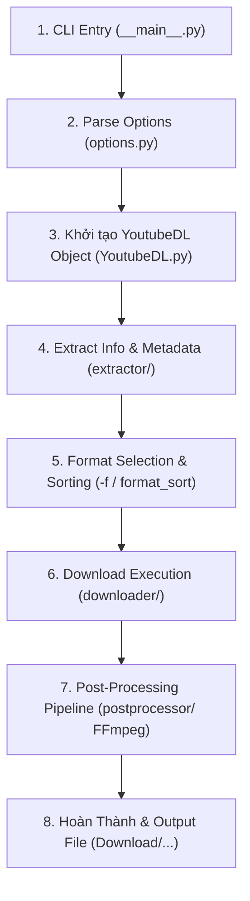

# 🧠 Kiến Trúc Lõi yt-dlp (yt-dlp Core Architecture Deep-Dive)

> **Tài liệu tham khảo kỹ thuật chuyên sâu về mã nguồn gốc của [yt-dlp](https://github.com/yt-dlp/yt-dlp)**  
> *Dành cho việc tra cứu, mở rộng, debug và tối ưu hóa hệ thống `EveryVideoDownloader`.*

---

## 1. 🌐 Tổng Quan & Triết Lý Thiết Kế (Overview & Philosophy)

`yt-dlp` là một dự án mã nguồn mở bằng ngôn ngữ Python (phát triển từ nhánh rẽ nâng cao của `youtube-dl`), đóng vai trò là **công cụ bóc tách và tải đa phương tiện mạnh mẽ nhất thế giới** hỗ trợ hơn **1.800+ nền tảng trực tuyến** (YouTube, Bilibili, TikTok, Douyin, Facebook, Twitter/X, Instagram, Twitch, Vimeo, SoundCloud,...).

### Những Điểm Cải Tiến Vượt Trội So Với `youtube-dl` Gốc:
1. **Hiệu năng & Đa luồng (-N / --concurrent-fragments)**: Hỗ trợ tải song song các phân mảnh DASH/HLS giúp tăng tốc từ 4x – 10x.
2. **Cơ chế chọn định dạng nâng cao (Format Sorting & Selection Engine)**: Đại số chọn format mạnh mẽ (`-f "bv*[height<=1080]+ba/b"`, `format_sort`).
3. **Trích xuất Cookie Trực Tiếp Từ Trình Duyệt (`--cookies-from-browser`)**: Tự động giải mã cookie từ Chrome, Firefox, Edge, Brave qua Windows DPAPI / macOS Keychain / Linux SecretService.
4. **Tích hợp giải mã JavaScript Nhúng (`jsinterp.py`)**: Tự giả lập JS runtime để giải mã `n-sig` token và player cipher của YouTube mà không phụ thuộc V8/Node.js cồng kềnh.
5. **Networking Layer có thể cắm ghép (Pluggable Networking)**: Hỗ trợ `urllib`, `requests`, và `curl_cffi` (giả lập TLS fingerprint của trình duyệt thật để vượt Cloudflare/WAF).
6. **Hệ thống Post-Processor linh hoạt**: Tích hợp chặt chẽ với FFmpeg để ghép video/audio, chuyển đổi phụ đề, nhúng thumbnail, cắt chapter và tương tác SponsorBlock.

---

## 2. 📂 Cấu Trúc Cây Thư Mục & Các Module Chính (Directory Blueprint)

Toàn bộ gói mã nguồn của `yt-dlp` nằm trong thư mục gốc `yt_dlp/`:

```text
yt-dlp/
├── yt_dlp/
│   ├── __init__.py               # Điểm khởi tạo, export YoutubeDL class & hàm main()
│   ├── __main__.py               # Điểm thực thi khi gọi: python -m yt_dlp
│   ├── YoutubeDL.py              # ⭐ TRÁI TIM CỦA ENGINE — Điều phối toàn bộ quy trình
│   ├── options.py                # Định nghĩa & phân tích cú pháp 200+ cờ lệnh CLI (OptParse/ArgParse)
│   ├── cookies.py                # Trình trích xuất & giải mã cookie từ các trình duyệt
│   ├── jsinterp.py               # Trình thông dịch AST JavaScript rút gọn (giải mã n-sig)
│   ├── update.py                 # Bộ tự động kiểm tra và cập nhật binary (--update)
│   │
│   ├── extractor/                # 🔍 BỘ TRÍCH XUẤT NỀN TẢNG (1.800+ Extractors)
│   │   ├── _extractors.py        # Danh sách Lazy-import toàn bộ extractors
│   │   ├── common.py             # Lớp cơ sở InfoExtractor, SearchInfoExtractor
│   │   ├── youtube/              # Module YouTube chuyên sâu (InnerTube, n-sig, po_token,...)
│   │   ├── bilibili.py           # Extractor Bilibili (DASH streams, audio tracks, bangumi)
│   │   ├── tiktok.py             # Extractor TikTok
│   │   ├── douyin.py             # Extractor Douyin
│   │   ├── facebook.py           # Extractor Facebook
│   │   ├── twitter.py            # Extractor Twitter/X
│   │   ├── instagram.py          # Extractor Instagram
│   │   └── ... (hàng ngàn extractors khác)
│   │
│   ├── downloader/               # 📥 BỘ ĐIỀU KHIỂN TẢI DỮ LIỆU (Download Engines)
│   │   ├── common.py             # Lớp cơ sở FileDownloader & quản lý tốc độ/tiến trình
│   │   ├── http.py               # Tải HTTP Range chunked thông thường (HttpFD)
│   │   ├── fragment.py           # Lớp cơ sở tải đa phân mảnh (FragmentFD)
│   │   ├── hls.py                # Tải luồng HTTP Live Streaming (.m3u8)
│   │   ├── dash.py               # Tải luồng Dynamic Adaptive Streaming over HTTP (.mpd)
│   │   ├── f4m.py & ism.py       # Tải Adobe Flash Media & Smooth Streaming
│   │   └── external.py           # Wrapper gọi downloader ngoài: aria2c, ffmpeg, curl, wget
│   │
│   ├── postprocessor/            # 🎬 BỘ HẬU KỲ XỬ LÝ (Post-Processing via FFmpeg)
│   │   ├── common.py             # Lớp cơ sở PostProcessor
│   │   ├── ffmpeg.py             # FFmpegMergerPP, FFmpegExtractAudioPP, FFmpegMetadataPP,...
│   │   ├── embedthumbnail.py     # Nhúng ảnh thumbnail vào metadata file MP4/MKV/MP3
│   │   ├── sponsorblock.py       # Tự động cắt/đánh dấu đoạn quảng cáo qua SponsorBlock API
│   │   └── modify_chapters.py    # Xử lý chapter video
│   │
│   ├── networking/               # 🌐 TẦNG MẠNG & GIẢ LẬP KẾT NỐI (Networking Layer)
│   │   ├── _urllib.py            # Backend mạng mặc định qua urllib.request
│   │   ├── _requests.py          # Backend mạng qua thư viện requests
│   │   ├── _curlcffi.py          # Backend TLS Fingerprint giả lập Chrome/Safari
│   │   └── common.py             # Interface Request, Response, Session, CookieJar
│   │
│   ├── utils/                    # 🛠️ THƯ VIỆN HỖ TRỢ ĐA DỤNG (Utilities & Helpers)
│   │   ├── _utils.py             # Clean HTML, parse ISO date, format size, sanitize filename
│   │   ├── traverse.py           # Truy vết dữ liệu lồng nhau an toàn (traverse_obj)
│   │   └── networking.py         # HTTP header helpers, user-agent generators
│   │
│   └── compat/                   # Lớp tương thích ngược các phiên bản Python cũ
```

---

## 3. 🔄 Vòng Đời Thực Thi & Luồng Xử Lý (Execution Lifecycle)

Khi người dùng thực thi một lệnh như:
```bash
yt-dlp --cookies-from-browser firefox -N 8 -f "30080" "https://..."
```

Engine sẽ trải qua **6 giai đoạn chuẩn mực**:



### Chi Tiết Từng Giai Đoạn:

### Giai Đoạn 1 & 2: Phân Tích Cấu Hình (`options.py` ➔ `YoutubeDL.py`)
- `options.py` sử dụng trình phân tích tham số để đọc `sys.argv`, nạp file cấu hình người dùng (`yt-dlp.conf`), biến môi trường, chuyển đổi thành `params` dictionary (gồm `format`, `outtmpl`, `cookies`, `concurrent_fragment`,...).
- Nạp Cookie từ trình duyệt nếu có cờ `--cookies-from-browser` thông qua `yt_dlp/cookies.py`.

### Giai Đoạn 3: Khởi Tạo Bộ Điều Phối (`YoutubeDL.py`)
- Khởi tạo instance `ydl = YoutubeDL(params)`.
- Đăng ký các `PostProcessor` tương ứng với các cờ (FFmpeg Merger, Embed Subtitles, Embed Thumbnail,...).
- Khởi tạo session mạng (`networking/`) với Proxy, User-Agent và CookieJar.

### Giai Đoạn 4: Trích Xuất Siêu Dữ Liệu (`extract_info`)
- `YoutubeDL.extract_info(url)` duyệt qua danh sách các `InfoExtractor` để tìm extractor phù hợp bằng phương thức `_match_valid_url(url)`.
- Extractor gọi `_real_extract(url)`:
  - Gửi request lấy HTML/JSON từ trang web.
  - Phân giải chữ ký token (gọi `jsinterp.py` nếu là YouTube).
  - Trích xuất luồng video/audio từ manifest (HLS `.m3u8` hoặc DASH `.mpd`).
  - Trả về từ điển metadata chuẩn hóa (`info_dict` chứa `id`, `title`, `formats`, `subtitles`, `thumbnails`, `duration`,...).

### Giai Đoạn 5: Bộ Lọc & Chọn Định Dạng (`process_video_result`)
- Nếu chạy ở chế độ `-J` (`--dump-json`) hoặc `-F` (`--list-formats`): `yt-dlp` in toàn bộ danh sách format và kết thúc.
- Nếu ở chế độ tải: Bộ chọn định dạng (`build_format_selector`) so khớp chuỗi `-f` với danh sách formats để chọn ra format video và format audio phù hợp nhất.

### Giai Đoạn 6: Tải Dữ Liệu (`downloader/`)
- Căn cứ vào protocol của format được chọn (`http`, `m3u8`, `mpd`,...):
  - HTTP trực tiếp ➔ Khởi chạy `HttpFD` hoặc `external.py` (aria2c).
  - HLS / DASH phân mảnh ➔ Khởi chạy `FragmentFD` / `HlsFD` / `DashFD` tải song song `N` phân mảnh vào file tạm `.part`.
- Phát log định dạng chuẩn: `[download] {pct}% of ~{total} at {speed} ETA {eta}`.

### Giai Đoạn 7: Hậu Kỳ Xử Lý (`postprocessor/`)
- Nếu chọn 1 video-only stream và 1 audio-only stream: `FFmpegMergerPP` gọi FFmpeg để mux (ghép) 2 file thành 1 container (`.mkv`, `.mp4` hoặc `.webm`).
- Nếu bật `--embed-subs`: `FFmpegEmbedSubtitlePP` nhúng phụ đề vào file.
- Nếu bật `--embed-thumbnail`: `EmbedThumbnailPP` dùng AtomicParsley/FFmpeg chèn ảnh bìa.
- Đổi tên file tạm `.part` thành tên file chính thức (`outtmpl`).

---

## 4. 🔬 Chi Tiết Các Phân Hệ Cốt Lõi (Core Subsystems Deep-Dive)

---

### A. Phân Hệ Extractor (`yt_dlp/extractor/common.py`)

Mọi Extractor đều kế thừa từ lớp `InfoExtractor`:

```python
class InfoExtractor:
    IE_NAME = 'example'
    _VALID_URL = r'https?://(?:www\.)?example\.com/video/(?P<id>[0-9]+)'
    
    def _real_extract(self, url):
        video_id = self._match_id(url)
        webpage = self._download_webpage(url, video_id)
        
        title = self._search_regex(r'<title>(.+?)</title>', webpage, 'title')
        formats = self._extract_m3u8_formats(m3u8_url, video_id, 'mp4')
        
        return {
            'id': video_id,
            'title': title,
            'formats': formats,
            'thumbnail': self._og_search_thumbnail(webpage),
        }
```

#### Các Phương Thức Trợ Giúp Cực Kỳ Hữu Ích Cần Biết:
- `_download_webpage()`: Tải HTML kèm retry, xử lý mã hóa charset tự động.
- `_download_json()`: Tải và `json.loads` trực tiếp từ API.
- `_search_regex()`: Trích xuất chuỗi bằng Regex an toàn (không crash nếu không tìm thấy, có fallback).
- `_extract_m3u8_formats()`: Tự động phân tích file manifest HLS `.m3u8`, trích xuất toàn bộ các độ phân giải, bitrate, audio tracks.
- `_extract_mpd_formats()`: Tự động bóc tách manifest MPEG-DASH `.mpd`.
- `_parse_json()` / `traverse_obj()`: Truy vết an toàn qua các cấu trúc JSON sâu nhiều tầng.

---

### B. Đại Số & Cú Pháp Chọn Định Dạng (`-f` Grammar)

Cú pháp `-f` của `yt-dlp` được biên dịch thành cây cú pháp trừu tượng (AST):

| Cú Pháp | Ý Nghĩa | Ví Dụ |
| :--- | :--- | :--- |
| `bv*+ba/b` | Video tốt nhất ghép Audio tốt nhất, fallback sang Combo tốt nhất | `yt-dlp -f "bv*+ba/b"` |
| `[filter]` | Bộ lọc theo thuộc tính | `bv*[height<=1080][ext=mp4]` |
| `+` (Operator) | Ghép 2 luồng độc lập bằng FFmpeg | `137+140` (1080p video + 128k AAC) |
| `/` (Fallback) | Ưu tiên định dạng trước, nếu không có chọn định dạng sau | `bestvideo[height=2160]/bestvideo[height=1080]` |
| `,` (Multi) | Tải nhiều định dạng thành các file riêng biệt | `bestvideo,bestaudio` |
| `ID` Cụ thể | Chỉ định chính xác ID của format trong bảng `-F` | `-f "30080"` (Bilibili 1080p 60fps) |

---

### C. Phân Hệ Trích Xuất & Giải Mã Cookie (`yt_dlp/cookies.py`)

`yt-dlp` có khả năng đọc trực tiếp SQLite database của các trình duyệt trên máy tính người dùng mà không cần cài extension xuất cookies.txt:

1. **Vị trí Database**:
   - Chrome/Brave/Edge: `%LOCALAPPDATA%\Google\Chrome\User Data\Default\Network\Cookies`
   - Firefox: `%APPDATA%\Mozilla\Firefox\Profiles\*.default-release\cookies.sqlite`
2. **Giải Mã Bảo Mật (Decryption)**:
   - **Windows**: Đọc khóa `Local State`, giải mã Master Key bằng **Windows DPAPI** (`CryptUnprotectData`), sau đó dùng **AES-256-GCM** để giải mã trường `encrypted_value` trong bảng `cookies`.
   - **Firefox**: Đọc trực tiếp trường plaintext hoặc giải mã qua thư viện NSS nếu có master password.

---

### D. Trình Thông Dịch JavaScript Nhúng (`yt_dlp/jsinterp.py`)

Để giải mã thuật toán chống bóp băng thông của YouTube (thuật toán biến đổi tham số `n` trong URL phát video):
- YouTube làm rối mã nguồn hàm giải mã trong `base.js` của player.
- Thay vì gọi Node.js hay V8, `yt-dlp` xây dựng một **JS Interpreter mini dựa trên AST**:
  - Phân tích cú pháp các hàm gán mảng, đảo chuỗi, toán tử bitwise (`>>`, `<<`, `^`).
  - Thực thi giả lập các phép biến đổi toán học để sinh ra chuỗi `n` hợp lệ, giúp video YouTube tải ở tốc độ tối đa đường truyền không bị bóp về 40-50 KB/s.

---

### E. Phân Hệ Hậu Kỳ FFmpeg (`yt_dlp/postprocessor/ffmpeg.py`)

`yt-dlp` tự động nhận diện `ffmpeg.exe` tại thư mục hiện tại hoặc trong `PATH`:
- **Ghép luồng (Muxing)**: `ffmpeg -i video.mp4 -i audio.m4a -c copy -map 0:v:0 -map 1:a:0 output.mkv`
- **Trích xuất âm thanh**: `ffmpeg -i input.mp4 -vn -c:a libmp3lame -q:a 0 output.mp3`
- **Chuyển đổi phụ đề**: `ffmpeg -i input.vtt output.srt`
- **Nhúng bìa HD**: Sử dụng cờ `-c copy -disposition:v:1 attached_pic`

---

## 5. 🔌 Cách `EveryVideoDownloader` Tích Hợp & Mở Rộng `yt-dlp`

Hệ thống **EveryVideoDownloader** được xây dựng như một lớp vỏ điều khiển giao diện Desktop Studio chuyên nghiệp (Web Desktop Studio) tương tác với `yt-dlp`:

```
┌────────────────────────────────────────────────────────────────────────┐
│ FRONTEND (Vanilla JS + HTML5 + CSS Glassmorphism Studio)               │
│ - Bảng formats tương tác, Sort 3 trạng thái, Hàng chờ, Subtitles Explorer│
└───────────────────────────────────┬────────────────────────────────────┘
                                    │ HTTP REST & SSE EventStream
┌───────────────────────────────────▼────────────────────────────────────┐
│ BACKEND SERVER (Node.js & Express - server.js)                         │
│ ├─ GET /api/info             ➔ Gọi yt-dlp -J hoặc Direct Engines        │
│ ├─ GET /api/download         ➔ Stream tiến trình SSE (%/Speed/ETA/Size)│
│ ├─ GET /api/download-subtitle➔ Tải & convert VTT ➔ SRT trực tiếp       │
│ ├─ Direct Douyin Engine      ➔ aid=6383 PC Client (Mở khóa 4K/2K/1080p)│
│ └─ Direct TikTok Engine      ➔ Bỏ qua WAF & Anti-bot challenge         │
└───────────────────────────────────┬────────────────────────────────────┘
                                    │ child_process.spawn()
┌───────────────────────────────────▼────────────────────────────────────┐
│ CORE ENGINE (yt-dlp.exe + ffmpeg.exe)                                  │
│ - Nạp Cookies, đa luồng (-N 8), Chunk Size (10M), Format ID chính xác  │
└────────────────────────────────────────────────────────────────────────┘
```

### Các Kỹ Thuật Tối Ưu Đã Áp Dụng:
1. **Thực thi Portable**: Mọi đường dẫn trong `server.js` đều dùng `path.join(__dirname, ...)` đảm bảo chạy độc lập trên mọi thư mục/USB.
2. **Streaming SSE thời gian thực**: Bắt sự kiện stdout từ `yt-dlp.exe --newline`, dùng Regex bóc tách `%`, tốc độ `MiB/s`, `ETA`, `Dung lượng` để vẽ giao diện trực tiếp.
3. **Bypass cơ chế Anti-Bot riêng biệt**: Khi một số website nâng cấp thuật toán chặn (như TikTok WAF challenge hay Douyin web limit 720p), backend Node.js sẽ chủ động kích hoạt các Engine trực tiếp chuyên dụng trước khi fallback về `yt-dlp`.

---

## 6. 📑 Bảng Tra Cứu Biến & Lớp Quan Trọng (Symbol Reference)

| Ký Hiệu / Lớp | File Nguồn | Mô Tả Chức Năng |
| :--- | :--- | :--- |
| `YoutubeDL` | `yt_dlp/YoutubeDL.py` | Lớp nhạc trưởng điều phối phân tích, nạp cookie, chọn format và tải |
| `InfoExtractor` | `yt_dlp/extractor/common.py` | Lớp cha của 1.800+ extractors trang web |
| `FileDownloader` | `yt_dlp/downloader/common.py` | Lớp cha quản lý tiến trình tải dữ liệu |
| `FragmentFD` | `yt_dlp/downloader/fragment.py` | Lớp quản lý tải đa luồng phân mảnh DASH/HLS |
| `HttpFD` | `yt_dlp/downloader/http.py` | Trình tải các file HTTP dạng Range |
| `FFmpegPostProcessor` | `yt_dlp/postprocessor/ffmpeg.py` | Lớp cha cho mọi thao tác gọi FFmpeg |
| `JSInterpreter` | `yt_dlp/jsinterp.py` | Trình giải mã thuật toán n-sig và signature YouTube |
| `extract_cookies_from_browser` | `yt_dlp/cookies.py` | Trích xuất cookie trực tiếp từ SQLite DB của trình duyệt |
| `traverse_obj` | `yt_dlp/utils/traverse.py` | Hàm trích xuất dữ liệu đa tầng từ JSON an toàn |

---

*Tài liệu này được lưu trữ tại [`D:\yt-dlp\YTDLP_CORE_ARCHITECTURE.md`](file:///D:/yt-dlp/YTDLP_CORE_ARCHITECTURE.md) để phục vụ tra cứu mọi lúc.*
