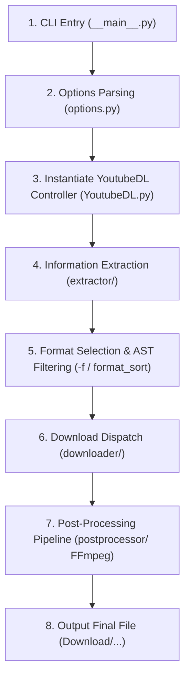

# 🧠 yt-dlp Core Engine Architecture & Reference Guide

> **Comprehensive Technical Architecture Reference for the [yt-dlp](https://github.com/yt-dlp/yt-dlp) Codebase**  
> *Targeted for AI agents and developers for codebase indexing, feature extension, debugging, and system optimization within `EveryVideoDownloader`.*

---

## 1. 🌐 Overview & Architectural Philosophy

`yt-dlp` is a Python-based command-line media extractor and downloader (an advanced fork of `youtube-dl`). It serves as the **world's most feature-rich open-source media scraping and streaming engine**, supporting over **1,800+ online video/audio platforms** (YouTube, Bilibili, TikTok, Douyin, Facebook, Twitter/X, Instagram, Twitch, Vimeo, SoundCloud, and more).

### Key Architectural Advantages Over Legacy `youtube-dl`:
1. **Multi-Threaded Fragment Downloads (`-N / --concurrent-fragments`)**: Concurrent segment fetching for DASH/HLS protocols yielding 4x–10x speedups.
2. **Advanced Format Sorting & Selection Algebra**: Full AST-based format expression evaluator (`-f "bv*[height<=1080]+ba/b"`, `format_sort`).
3. **Live Browser Cookie Extraction (`--cookies-from-browser`)**: Direct SQLite database reading and OS-level decryption (Windows DPAPI + AES-256-GCM, macOS Keychain, Linux SecretStorage) across Chrome, Firefox, Edge, Brave, Opera, Safari.
4. **Embedded AST JavaScript Interpreter (`jsinterp.py`)**: Custom lightweight JS engine written in pure Python that evaluates player cipher routines and `n-sig` anti-throttling tokens without requiring external V8 or Node.js runtimes.
5. **Pluggable Networking Architecture**: Modular transport layer supporting `urllib`, `requests`, and `curl_cffi` (browser TLS fingerprint impersonation to bypass Cloudflare/WAFs).
6. **Extensible Post-Processing Pipeline**: Direct FFmpeg pipeline integration for container muxing, subtitle conversion, metadata tagging, and SponsorBlock chapter excision.

---

## 2. 📂 Directory Blueprint & Core Module Topology

The core engine resides in the `yt_dlp/` package:

```text
yt-dlp/
├── yt_dlp/
│   ├── __init__.py               # Package entry point; exports YoutubeDL class & main()
│   ├── __main__.py               # CLI invocation entry point (python -m yt_dlp)
│   ├── YoutubeDL.py              # ⭐ CORE ORCHESTRATOR — Coordinates extraction, filtering, & downloads
│   ├── options.py                # Parses 200+ CLI flags into configuration dict (params)
│   ├── cookies.py                # Browser profile discovery & cookie decryption engine
│   ├── jsinterp.py               # Lightweight AST-based JavaScript execution interpreter
│   ├── update.py                 # Self-updater mechanism (--update / -U)
│   │
│   ├── extractor/                # 🔍 EXTRACTION SUBSYSTEM (1,800+ Site Extractors)
│   │   ├── _extractors.py        # Auto-generated lazy imports for all extractors
│   │   ├── common.py             # Base InfoExtractor & SearchInfoExtractor classes
│   │   ├── youtube/              # Deep YouTube extractor module (InnerTube, po_token, n-sig, etc.)
│   │   ├── bilibili.py           # Bilibili DASH streams, multi-audio tracks, & Bangumi
│   │   ├── tiktok.py             # TikTok mobile & web extractor
│   │   ├── douyin.py             # Douyin video and live extractor
│   │   ├── facebook.py           # Facebook Graph & Dash extractor
│   │   ├── twitter.py            # Twitter/X GraphQL & syndicate API extractor
│   │   ├── instagram.py          # Instagram GraphQL & post extractor
│   │   └── ... (thousands of platform extractors)
│   │
│   ├── downloader/               # 📥 DOWNLOAD ENGINE SUBSYSTEM
│   │   ├── common.py             # Base FileDownloader class (progress tracking, throttling)
│   │   ├── http.py               # Standard HTTP Range chunk downloader (HttpFD)
│   │   ├── fragment.py           # Base multi-fragment concurrent downloader (FragmentFD)
│   │   ├── hls.py                # HTTP Live Streaming (.m3u8) downloader (HlsFD)
│   │   ├── dash.py               # MPEG-DASH (.mpd) stream downloader (DashFD)
│   │   ├── f4m.py & ism.py       # Adobe Flash Media & Microsoft Smooth Streaming engines
│   │   └── external.py           # Subprocess wrappers for external downloaders (aria2c, ffmpeg, curl)
│   │
│   ├── postprocessor/            # 🎬 POST-PROCESSING SUBSYSTEM (FFmpeg & Mutagen)
│   │   ├── common.py             # Base PostProcessor class
│   │   ├── ffmpeg.py             # FFmpegMergerPP, FFmpegExtractAudioPP, FFmpegMetadataPP, etc.
│   │   ├── embedthumbnail.py     # HD thumbnail tag embedding (AtomicParsley / FFmpeg)
│   │   ├── sponsorblock.py       # SponsorBlock API integration for chapter marking/cutting
│   │   └── modify_chapters.py    # Chapter modification & splitting
│   │
│   ├── networking/               # 🌐 NETWORK & TRANSPORT SUBSYSTEM
│   │   ├── _urllib.py            # Default urllib.request transport backend
│   │   ├── _requests.py          # requests library transport backend
│   │   ├── _curlcffi.py          # curl_cffi backend for browser TLS fingerprint impersonation
│   │   └── common.py             # Request, Response, Session, and CookieJar abstractions
│   │
│   ├── utils/                    # 🛠️ GENERAL UTILITIES & DATA PARSERS
│   │   ├── _utils.py             # Data sanitization, date/size formatters, HTML cleaners
│   │   ├── traverse.py           # Safe multi-tier JSON traversal utility (traverse_obj)
│   │   └── networking.py         # HTTP header generators and User-Agent helpers
│   │
│   └── compat/                   # Python 3.8+ compatibility and polyfills
```

---

## 3. 🔄 Complete Execution Lifecycle

When invoked via command line or API (e.g. `yt-dlp --cookies-from-browser firefox -N 8 -f "30080" URL`), execution proceeds through 6 structured phases:



### Phase Breakdown:

### Phase 1 & 2: Options Parsing & Initialization (`options.py` ➔ `YoutubeDL.py`)
- `options.py` parses `sys.argv`, user configuration files (`yt-dlp.conf`), and environment variables into a unified `params` dict.
- Browser cookies are extracted via `yt_dlp/cookies.py` if `--cookies-from-browser` is specified.

### Phase 3: Controller Instantiation (`YoutubeDL.py`)
- Creates `ydl = YoutubeDL(params)`.
- Instantiates network session managers, registers active `PostProcessor` hooks (FFmpeg Merger, Subtitle Converter, Thumbnail Embedder, etc.).

### Phase 4: Metadata Extraction (`extract_info`)
- `YoutubeDL.extract_info(url)` iterates through registered `InfoExtractor` classes, executing `_match_valid_url(url)` regex matching.
- The matching extractor invokes `_real_extract(url)`:
  - Fetches HTML / JSON payloads.
  - De-obfuscates player tokens (via `jsinterp.py` if YouTube).
  - Parses streaming manifests (HLS `.m3u8` or MPEG-DASH `.mpd`).
  - Returns a standardized `info_dict` containing `id`, `title`, `formats`, `subtitles`, `thumbnails`, `duration`, etc.

### Phase 5: Format Selection Engine (`process_video_result`)
- If run in metadata dump mode (`-J` / `--dump-json` or `-F` / `--list-formats`), outputs formatted data and exits.
- If downloading, `build_format_selector` evaluates the `-f` expression tree against available streams to isolate the exact video and audio stream IDs.

### Phase 6: Download Execution (`downloader/`)
- Based on stream protocol (`http`, `m3u8`, `mpd`):
  - HTTP Range stream ➔ Spawns `HttpFD` or external downloader (`aria2c`).
  - HLS / DASH stream ➔ Spawns `FragmentFD` / `HlsFD` / `DashFD` with `N` parallel worker threads downloading into a `.part` temporary buffer.
- Emits real-time stdout logs: `[download] {pct}% of ~{total} at {speed} ETA {eta}`.

### Phase 7: Post-Processing & Muxing (`postprocessor/`)
- `FFmpegMergerPP` multiplexes isolated video-only and audio-only streams into the specified target container (`.mkv`, `.mp4`, `.webm`).
- Subtitles and metadata are converted/embedded if requested (`FFmpegEmbedSubtitlePP`, `EmbedThumbnailPP`).
- The temporary `.part` file is atomically renamed to the final destination path (`outtmpl`).

---

## 4. 🔬 Deep Dive Into Core Subsystems

---

### A. Extractor Subsystem (`yt_dlp/extractor/common.py`)

All extractors inherit from the base `InfoExtractor` class:

```python
class InfoExtractor:
    IE_NAME = 'example'
    _VALID_URL = r'https?://(?:www\.)?example\.com/video/(?P<id>[0-9]+)'
    
    def _real_extract(self, url):
        video_id = self._match_id(url)
        webpage = self._download_webpage(url, video_id)
        
        title = self._search_regex(r'<title>(.+?)</title>', webpage, 'title')
        formats = self._extract_m3u8_formats(m3u8_url, video_id, 'mp4')
        
        return {
            'id': video_id,
            'title': title,
            'formats': formats,
            'thumbnail': self._og_search_thumbnail(webpage),
        }
```

#### Essential Helper Methods:
- `_download_webpage()`: Downloads HTML with automatic retries, encoding detection, and cookie persistence.
- `_download_json()`: Fetches JSON endpoints with direct deserialization and error handling.
- `_search_regex()`: Robust regex extraction with default fallback support (prevents uncaught exceptions).
- `_extract_m3u8_formats()`: Automatically parses HLS master playlists, extracting resolutions, bitrates, audio codecs, and fragment URLs.
- `_extract_mpd_formats()`: Binds and parses MPEG-DASH manifests.
- `traverse_obj()`: Deep key traversal utility across complex nested JSON dictionaries without KeyErrors.

---

### B. Format Selection Grammar Algebra (`-f`)

Format expressions are parsed into an Abstract Syntax Tree (AST):

| Syntax Pattern | Semantics | Practical Example |
| :--- | :--- | :--- |
| `bv*+ba/b` | Best Video + Best Audio; fallback to Best Combo | `yt-dlp -f "bv*+ba/b"` |
| `[filter]` | Property-based stream filtering | `bv*[height<=1080][ext=mp4]` |
| `+` (Merge Operator) | Multiplex two separate streams via FFmpeg | `137+140` (1080p video + 128k AAC audio) |
| `/` (Fallback Operator) | Try left expression; if absent, try right expression | `bestvideo[height=2160]/bestvideo[height=1080]` |
| `,` (Multi Operator) | Download multiple streams as separate output files | `bestvideo,bestaudio` |
| Exact `ID` | Force download of an explicit format ID from `-F` | `-f "30080"` (Bilibili 1080p 60fps) |

---

### C. Live Browser Cookie Extraction Subsystem (`yt_dlp/cookies.py`)

`yt-dlp` reads directly from local browser profile databases without requiring manual `.txt` cookie exports:

1. **Storage Paths**:
   - Chromium / Chrome / Brave / Edge: `%LOCALAPPDATA%\Google\Chrome\User Data\Default\Network\Cookies`
   - Firefox: `%APPDATA%\Mozilla\Firefox\Profiles\*.default-release\cookies.sqlite`
2. **Decryption Pipelines**:
   - **Windows**: Reads `Local State` file, extracts the Master Key via **Windows DPAPI** (`CryptUnprotectData`), and decrypts `encrypted_value` records using **AES-256-GCM**.
   - **Firefox**: Reads plaintext SQLite rows directly or queries NSS library storage.

---

### D. Lightweight JavaScript Interpreter (`yt_dlp/jsinterp.py`)

To counter YouTube's client-side bandwidth throttling (the dynamic `n` token transformation embedded in `base.js`):
- YouTube obfuscates player transformation functions.
- `yt-dlp` implements a **lightweight AST JavaScript Interpreter**:
  - Parses array rotations, bitwise operations (`>>`, `<<`, `^`), and closures.
  - Emulates mathematical transformations in Python to compute the valid `n` parameter, ensuring downloads run at full wire speed rather than being throttled to ~40 KB/s.

---

### E. FFmpeg Post-Processing Subsystem (`yt_dlp/postprocessor/ffmpeg.py`)

Automatically detects `ffmpeg.exe` in local directory or system `PATH`:
- **Stream Multiplexing**: `ffmpeg -i video.mp4 -i audio.m4a -c copy -map 0:v:0 -map 1:a:0 output.mkv`
- **Audio Extraction**: `ffmpeg -i input.mp4 -vn -c:a libmp3lame -q:a 0 output.mp3`
- **Subtitle Conversion**: `ffmpeg -i input.vtt output.srt`
- **HD Cover Attachment**: Uses `-c copy -disposition:v:1 attached_pic` for MKV/MP4 containers.

---

## 5. 🔌 Integration in `EveryVideoDownloader`

`EveryVideoDownloader` acts as a high-performance **Desktop Web Studio** layer on top of `yt-dlp`:

```
┌────────────────────────────────────────────────────────────────────────┐
│ FRONTEND (Vanilla JS + HTML5 + CSS Glassmorphism Studio)               │
│ - Interactive Format Table, 3-State Sort, Queue, Subtitles Explorer   │
└───────────────────────────────────┬────────────────────────────────────┘
                                    │ HTTP REST & SSE EventStream
┌───────────────────────────────────▼────────────────────────────────────┐
│ BACKEND SERVER (Node.js & Express - server.js)                         │
│ ├─ GET /api/info             ➔ Calls yt-dlp -J or Direct Engines        │
│ ├─ GET /api/download         ➔ Streams SSE progress (%/Speed/ETA/Size) │
│ ├─ GET /api/download-subtitle➔ Direct VTT ➔ SRT conversion & download   │
│ ├─ Direct Douyin Engine      ➔ aid=6383 PC Client (4K/2K/1080p Unlock) │
│ └─ Direct TikTok Engine      ➔ Bypasses WAF & Anti-bot challenge       │
└───────────────────────────────────┬────────────────────────────────────┘
                                    │ child_process.spawn()
┌───────────────────────────────────▼────────────────────────────────────┐
│ CORE ENGINE (yt-dlp.exe + ffmpeg.exe)                                  │
│ - Cookie Auth, Multi-threading (-N 8), Chunk Size (10M), Exact IDs    │
└────────────────────────────────────────────────────────────────────────┘
```

### Applied Optimization Patterns:
1. **100% Portable Execution**: All paths in `server.js` resolve relative to `__dirname`.
2. **Real-time SSE Streaming**: Captures `yt-dlp.exe --newline` stdout, parses progress tokens via regex, and streams metric updates to the frontend.
3. **Direct Specialized Fallbacks**: When platforms deploy aggressive web anti-bot challenges (e.g. TikTok WAF or Douyin 720p web cap), the Node.js backend transparently engages specialized API endpoints before falling back to `yt-dlp`.

---

## 6. 📑 Key Symbols & Classes Reference Table

| Symbol / Class | Source File | Core Responsibility |
| :--- | :--- | :--- |
| `YoutubeDL` | `yt_dlp/YoutubeDL.py` | Central orchestrator for parsing, cookie loading, format selection, & download execution |
| `InfoExtractor` | `yt_dlp/extractor/common.py` | Base class for 1,800+ website extractors |
| `FileDownloader` | `yt_dlp/downloader/common.py` | Base class managing byte streams, rate limits, and progress reporting |
| `FragmentFD` | `yt_dlp/downloader/fragment.py` | Worker engine for multi-threaded DASH/HLS segment downloads |
| `HttpFD` | `yt_dlp/downloader/http.py` | HTTP Range chunk stream downloader |
| `FFmpegPostProcessor` | `yt_dlp/postprocessor/ffmpeg.py` | Base wrapper for FFmpeg transcoding and multiplexing |
| `JSInterpreter` | `yt_dlp/jsinterp.py` | Pure-Python AST interpreter for YouTube cipher and `n-sig` de-obfuscation |
| `extract_cookies_from_browser` | `yt_dlp/cookies.py` | Decrypts and loads cookies directly from local browser databases |
| `traverse_obj` | `yt_dlp/utils/traverse.py` | Safe multi-tier nested dictionary/array extraction helper |

---

*This reference file is maintained locally at [`D:\yt-dlp\YTDLP_CORE_ARCHITECTURE_EN.md`](file:///D:/yt-dlp/YTDLP_CORE_ARCHITECTURE_EN.md).*
