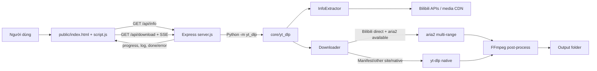

# Architecture

## Sơ đồ hệ thống

## Ranh giới trách nhiệm

### Frontend

`public/script.js` giữ state của URL hiện tại, browser cookie source, metadata, formats, subtitles, lựa chọn format, hàng chờ và EventSource đang chạy. Nó tạo query string cho backend và diễn giải log tải thành progress UI.

### Backend

`server.js` là lớp adapter giữa Web UI và engine:

- Đọc/lưu cấu hình runtime.
- Chuẩn hóa tham số UI thành CLI args của `yt_dlp`.
- Dùng `lib/download-acceleration.js` để chuẩn hóa engine/connections, resolve aria2 capability và chọn aria2 chỉ cho URL Bilibili direct; manifest vẫn native.
- Chọn resolver trực tiếp cho Douyin/TikTok hoặc fallback về engine chung.
- Quản lý child process/AbortController bằng `downloadId`.
- Chuyển stdout/stderr thành sự kiện SSE, gồm engine thực tế, fallback và CDN host đã che query.
- Cung cấp route phụ cho thumbnail, subtitle, dịch tiêu đề và folder picker.

### Python core

`core/yt_dlp` là một snapshot mã nguồn yt-dlp được vendored. Backend gọi bằng `python -u -m yt_dlp` với `PYTHONPATH=core`; vì vậy các thay đổi trong extractor cục bộ được dùng trực tiếp mà không cần cài package yt-dlp toàn hệ thống.

### FFmpeg

FFmpeg được dùng khi format video/audio tách rời cần mux, khi cắt đoạn, recode, đổi thumbnail hoặc nhúng metadata/phụ đề. Backend truyền `--ffmpeg-location` khi tìm thấy bản local; engine vẫn có thể tự tìm FFmpeg trong `PATH`.

## Luồng phân tích

1. Frontend gửi URL, nguồn cookie và tùy chọn Bilibili tới `/api/info`.
2. Backend tạo lệnh `yt_dlp -J`, mặc định `--no-playlist`.
3. Engine chọn extractor phù hợp và trả `info_dict` JSON.
4. Frontend chuẩn hóa formats để lọc, sắp xếp và chọn.

## Luồng tải

1. Frontend gửi format expression và tùy chọn tới `/api/download`.
2. Backend mở SSE, cấp `downloadId`, rồi spawn engine.
3. Với Bilibili, option builder chọn native hoặc aria2 multi-range cho HTTP(S) direct; mapping `dash,m3u8` luôn native.
4. Nếu Auto và aria2 lỗi ở external downloader, backend retry native đúng một lần bằng cùng output template.
5. Engine chọn format, tải fragment/file và gọi FFmpeg nếu cần; backend stream log/diagnostic để frontend cập nhật phần trăm, tốc độ, ETA và trạng thái.
6. Disconnect hoặc cancel sẽ cố dừng child process/AbortController và xóa task khỏi `activeDownloads`, không khởi động fallback sau cancel.

## Cấu hình và dữ liệu runtime

- `config.json` lưu cấu hình local và bị Git ignore.
- Frontend còn cache một số giá trị trong `localStorage`.
- `cookies.txt` là fallback nếu không chọn browser và file tồn tại; file này không được commit hay đưa vào vault.
- `Download/` là output mặc định; người dùng có thể chọn thư mục khác.
- Các file media lớn ở workspace là artifact runtime, không phải nguồn dự án.

## Phụ thuộc vận hành

- Node.js 18+ chạy server và frontend tooling.
- Python 3.9+ chạy core; thứ tự tìm là biến `EVERYVIDEO_PYTHON`, virtualenv local, rồi executable trong `PATH`.
- FFmpeg cần cho trải nghiệm tải video chất lượng cao đầy đủ.
- `aria2c` là tùy chọn; resolve từ `EVERYVIDEO_ARIA2C`, `bin/aria2c(.exe)` hoặc `PATH`. Thiếu aria2 không chặn native/Auto.
- Trình duyệt có thể cung cấp cookie cho nội dung yêu cầu đăng nhập.
