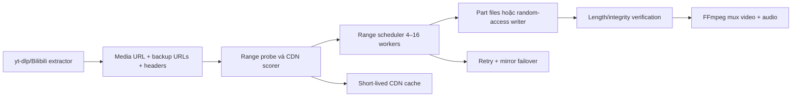

# Bilibili Download Speed Research

> [!summary] Kết luận ngắn
> Cấu hình hiện tại chưa tạo ra 8 kết nối song song cho một file Bilibili. `-N 8` chỉ áp dụng cho danh sách fragment DASH/HLS, còn Bilibili VOD thường được extractor trả về dưới dạng một URL HTTP(S) `.m4s`. `--http-chunk-size 100M` chỉ chia file thành các request Range **tuần tự**, không phải 100 MB/s và không phải 8 luồng. Hướng có xác suất cải thiện cao nhất là dùng aria2c để tải một media URL bằng nhiều Range connection, sau đó mới tối ưu CDN bằng benchmark thật thay vì ép cố định `upos-sz-mirroraliov`.

## Phạm vi và mức độ bằng chứng

- Đã đọc luồng hiện tại trong `server.js`, `core/yt_dlp/downloader/*` và custom extractor `core/yt_dlp/extractor/bilibili.py`.
- Đã đối chiếu tài liệu chính thức của yt-dlp và aria2, cùng mã/tài liệu của một số downloader Bilibili mã nguồn mở.
- Đã chạy smoke download mạng thật sau khi cài Python portable và `aria2c`; ma trận 21 case trên `BV1opg36pEPf` và hai vòng lặp 7 ứng viên đã hoàn tất, mọi lượt pass đều qua FFprobe. Gate đa video vẫn chưa đóng.
- Tốc độ tối đa không thể bảo đảm: kết quả phụ thuộc ISP, peering quốc tế, CDN edge, thời điểm, giới hạn theo IP/tài khoản và khả năng HTTP Range của media URL.

## 1. Vì sao cấu hình hiện tại vẫn quanh 1.5 MB/s

### 1.1 “8 luồng” đang là 8 fragment worker, không phải 8 Range connection

Backend truyền `--concurrent-fragments 8`. Trong yt-dlp, tùy chọn này được định nghĩa là số fragment DASH/HLS-native tải đồng thời; nó chỉ đi qua `FragmentFD`. [Tài liệu yt-dlp](https://github.com/yt-dlp/yt-dlp/blob/master/README.md#download-options) cũng mô tả đúng phạm vi này.

Custom Bilibili extractor hiện biến mỗi DASH video/audio thành một format có một trường `url`. Với VOD thông thường, URL đó là file `.m4s` HTTP(S), vì vậy yt-dlp chọn `HttpFD`, không có danh sách fragment để pool 8 worker xử lý. Kết quả: đặt 1, 8 hay 16 thường không thay đổi tốc độ của chính file media này.

> [!important] Diễn giải UI
> Tên “luồng tải” hiện dễ khiến người dùng hiểu là số kết nối cho mọi loại tải. Về mặt kỹ thuật, nó chỉ là “fragment đồng thời”. Nếu thêm aria2, UI nên tách thành hai cấu hình: **fragment workers** và **connections per file**.

### 1.2 “100M chunk” là Range tuần tự

`HttpFD` lấy `http_chunk_size`, mở request `Range: bytes=start-end`, ghi xong rồi nối tiếp vùng kế tiếp. Không có nhiều request chạy đồng thời. Theo [yt-dlp](https://github.com/yt-dlp/yt-dlp/blob/master/README.md#download-options), đây là cơ chế thử nghiệm có thể giúp né throttling theo request ở một số máy chủ, chứ không phải đặt băng thông mục tiêu.

Với `100M`, một kết nối chậm có thể tồn tại rất lâu trước khi request mới được tạo. Nếu throttling được reset theo connection/request, chunk nhỏ hơn như 1–10 MiB đáng thử; nếu giới hạn theo IP hoặc route thì đổi chunk gần như không giúp. Khi dùng aria2, backend hiện tắt HTTP chunk của yt-dlp để tránh hai cơ chế chồng nghĩa.

### 1.3 Ép `upos-sz-mirroraliov` không đồng nghĩa chọn CDN nhanh nhất

Custom extractor đang xử lý theo thứ tự:

1. Nếu người dùng chọn host cụ thể, rewrite `base_url` sang host đó và trả về ngay.
2. Chỉ ở chế độ auto mới cân nhắc base/backup URL và loại P2P.
3. Auto lấy backup “sạch” đầu tiên; không đo throughput, TTFB hay tỷ lệ lỗi.

Bilibili dùng nhiều edge/cache CDN và chất lượng route thay đổi theo ISP/vị trí. Chính Bilibili mô tả kiến trúc phân phối qua edge và regional cache trong [bài viết mạng CDN](https://www.bilibili.com/opus/740129406252482739), đồng thời cung cấp [trang chẩn đoán mạng](https://www.bilibili.com/blackboard/diagnostics.html). Vì vậy một hostname nhanh ở Trung Quốc hoặc một ISP khác có thể chậm ở mạng hiện tại.

Việc rewrite host còn có hai rủi ro: node đích không có object đó, hoặc chữ ký URL phụ thuộc host/vùng và trả 403/404. Do đó cần đo trên URL thật với headers/cookie hợp lệ, không chỉ ping hostname.

### 1.4 Geo bypass không phải VPN và không tăng throughput

`--geo-bypass` chỉ ảnh hưởng cách extractor thử vượt kiểm tra vùng ở những site hỗ trợ; nó không thay route mạng, không tạo proxy và không thêm kết nối. Bật nó không phải đòn bẩy tốc độ.

### 1.5 Cần xác nhận đơn vị

yt-dlp thường hiển thị `MiB/s`; `1.5 MiB/s` xấp xỉ 12.6 Mbit/s. Nếu người dùng đang nói `1.5 Mbit/s`, tốc độ thực chỉ khoảng 0.18 MiB/s. Benchmark và UI cần ghi rõ `MiB/s` hoặc `Mbit/s` để tránh sai lệch 8 lần.

## 2. Hướng ưu tiên cao nhất: yt-dlp + aria2c cho HTTP(S)

### Vì sao phù hợp với dự án

Lõi vendored đã có `Aria2cFD` và hỗ trợ giao thức HTTP/HTTPS. Wrapper có thể chuyển cookie, proxy và HTTP headers từ yt-dlp. Backend hiện đã có option builder/lifecycle Auto fallback; runtime portable `aria2c` 1.37.0 hiện nằm ở `.runtime/aria2/aria2c.exe` và resolver tự nhận diện mà không cần sửa PATH.

aria2 phân biệt rõ:

- `-j`: số item tải song song trong queue.
- `-s`: số connection cho một item/file.
- `-x`: số connection tối đa tới cùng một server.
- `-k`: kích thước split tối thiểu.

[Tài liệu aria2](https://aria2.github.io/manual/en/html/aria2c.html) xác nhận `-s` mới là cơ chế tải một file bằng nhiều kết nối và `-x` giới hạn số kết nối tới cùng host.

### Cấu hình thử nghiệm ban đầu

Không nên mặc định nhảy thẳng lên 16 hoặc 32. Bắt đầu với các profile có kiểm soát:

| Profile | aria2 | Mục đích |
| --- | --- | --- |
| A | `-x4 -s4 -k4M` | Ít áp lực CDN, baseline đa kết nối |
| B | `-x8 -s8 -k2M` | Ứng viên mặc định cân bằng; benchmark giữ x8 |
| C | `-x16 -s16 -k1M` | Kiểm tra trần khi CDN giới hạn theo connection |

Các profile cần giữ `--file-allocation=none`, resume, cookie và headers hiện có. Nếu gặp 403, 416, 429, aria2 exit code 29 hoặc tốc độ tụt về 0, tự hạ 16 → 8 → 4 rồi fallback native.

### Cách chọn downloader an toàn

yt-dlp cho phép chọn downloader theo protocol, ví dụ dùng aria2 cho HTTP/FTP và native cho manifest DASH/HLS. [README yt-dlp](https://github.com/yt-dlp/yt-dlp/blob/master/README.md#download-options) đưa đúng mẫu `--downloader aria2c --downloader "dash,m3u8:native"`.

Điều này quan trọng vì một [security advisory của yt-dlp](https://github.com/yt-dlp/yt-dlp/security/advisories/GHSA-vx4q-3cr2-7cg2) từng chỉ ra lỗ hổng khi đưa fragment manifest vào aria2 input file. Bản vá từ 2026.06.09 đã loại hỗ trợ aria2 cho manifest phân mảnh; core dự án đang ở 2026.07.04 nên đã sau mốc vá. Vẫn nên chỉ dùng aria2 cho URL media trực tiếp HTTP(S), còn HLS/DASH manifest giữ native.

### Kỳ vọng thực tế

- Nếu 1.5 MiB/s là cap **mỗi connection**, 4–8 Range connection có thể tăng rõ rệt.
- Nếu cap là **theo IP**, edge hoặc route quốc tế, aria2 có thể không tăng gì.
- Nếu disk/CPU là bottleneck thì aria2 cũng không giúp, nhưng ở 1.5 MiB/s điều này ít khả năng hơn.
- Tải video và audio song song có thể giảm wall-clock nhẹ; video thường lớn hơn nhiều nên không thay thế multi-range cho video.

## 3. Hướng ưu tiên thứ hai: CDN auto dựa trên đo tốc độ

### Vấn đề cần sửa trong kiến trúc

Extractor hiện đọc `backupUrl` nhưng cuối cùng chỉ trả một `url` cho format. Khi ép host, toàn bộ đa dạng backup bị bỏ qua. Vì vậy yt-dlp/aria2 không biết còn mirror nào để fallback hoặc chia tải.

### Thuật toán đề xuất

1. Giữ lại `baseUrl` và toàn bộ `backupUrl` trong metadata nội bộ; không log query token.
2. Parse hostname chuẩn, lọc P2P bằng hostname/suffix/port cụ thể thay vì substring toàn URL.
3. Với từng URL hợp lệ, tải mẫu Range 2–8 MiB bằng đúng `Referer`, `User-Agent`, cookie và proxy của phiên.
4. Ghi HTTP status, `Content-Range`, TTFB, throughput mẫu và lỗi.
5. Chạy 2–3 mẫu ngắn, xếp theo median throughput; loại host không support Range hoặc phản hồi sai object.
6. Cache kết quả theo network/host trong 15–60 phút, vì signed URL và CDN condition thay đổi.
7. Chọn URL nhanh nhất làm primary, giữ các URL hợp lệ khác làm fallback.

Không nên dùng latency/ping làm chỉ số duy nhất. Một node có RTT thấp vẫn có thể cache miss hoặc giới hạn throughput. Dự án cộng đồng [akamBiliChecker](https://github.com/ipcjs/akamBiliChecker) cũng tách kiểm tra độ trễ khỏi kiểm tra tốc độ tải thực; đây là một pattern hợp lý để tham khảo, không phải bằng chứng rằng mọi IP pinning đều an toàn.

### Multi-mirror với aria2

aria2 có thể nhận nhiều URI cho cùng một entity; `--uri-selector=feedback` hoặc `adaptive` dùng lịch sử/tình trạng để ưu tiên mirror và bỏ qua mirror chết, theo [manual chính thức](https://aria2.github.io/manual/en/html/aria2c.html). Tuy nhiên wrapper yt-dlp hiện chỉ truyền `info_dict['url']`, nên muốn dùng nhiều CDN thật sự cần:

- mở rộng format metadata để giữ các URL tương đương; và
- thêm wrapper/input cho aria2 hoặc một lớp downloader riêng.

Chỉ gộp các URL đã xác minh trỏ tới cùng media object/kích thước. Không tự tạo hàng loạt hostname bằng rewrite mù, nhất là URL Akamai hoặc URL có chữ ký phụ thuộc host.

## 4. Các cơ chế/download engine khác

| Hướng | Giá trị | Hạn chế | Khuyến nghị |
| --- | --- | --- | --- |
| yt-dlp extractor + aria2 process | Ít thay đổi, tận dụng cookie/format/mux hiện có | Cần đóng gói binary và parse progress | **P0 — làm trước** |
| aria2 RPC daemon | Pause/resume/cancel/queue tốt, nhiều URI | Quản lý process, RPC secret và lifecycle phức tạp hơn | P1 nếu cần download manager bền vững |
| Custom HTTP Range downloader trong Node/Rust | Kiểm soát worker, retry từng range, mirror failover, telemetry | Tự chịu trách nhiệm resume, file integrity, signed URL, API drift | P2 sau khi aria2 benchmark chứng minh multi-range có lợi |
| BBDown | Từng có multi-thread, aria2, custom UPOS và nhiều client API | [Repo gốc đã archive](https://github.com/nilaoda/BBDown); dùng như tài liệu thiết kế, không phụ thuộc sản xuất | Tham khảo pattern |
| BBDown-rust | Có resume Range, progress JSON, chiến lược UPOS/PCDN | [Roadmap](https://github.com/Joey-Project/BBDown-rust/blob/master/docs/PROJECT_TODO.md) vẫn ghi tích hợp aria2/multi-thread là việc chưa hoàn tất | PoC parser/engine, không phải thuốc tăng tốc tức thì |
| DownKyi Core | Từng đóng gói aria2/FFmpeg, Bilibili-specific | [Repo chính đã dừng bảo trì](https://github.com/yaobiao131/downkyicore) tháng 7/2026 | Chỉ nghiên cứu kiến trúc cũ |
| Lux | Có `--multi-thread` cho Bilibili | [Repo](https://github.com/iawia002/lux) phát hành mới nhất từ 2024, rủi ro API lỗi thời | Không ưu tiên production |
| Proxy/VPN | Có thể cải thiện route/peering | Chỉ giúp nếu route là bottleneck; tăng chi phí/độ phức tạp | A/B có kiểm soát, không bật mặc định |
| DNS/IP pinning | Có thể né DNS route xấu | IP/CDN thay đổi, dễ cache miss/403, khó bảo trì | Phương án cuối, app-local và TTL ngắn |

### Kiến trúc custom downloader nếu cần P2

Nếu aria2 chứng minh tăng tốc nhưng integration bị giới hạn, engine riêng nên có các phần sau:

Nguyên tắc: một ngân sách kết nối chung cho video/audio, retry từng range, resume bằng map các phần đã xong, hủy sạch process/file tạm, và verify kích thước trước mux. Không cần tự viết lại toàn bộ parser Bilibili ngay; vẫn có thể dùng yt-dlp làm extractor.

## 5. Ma trận benchmark bắt buộc trước khi chọn mặc định

### Dữ liệu cần ghi

- Cùng một video, cùng format ID/codec/resolution, cùng mạng.
- Host media thật và loại URL: direct `.m4s` hay manifest; không lưu query token.
- Base host và danh sách backup host.
- DNS result rút gọn, HTTP status, `Accept-Ranges`/`Content-Range`, TTFB.
- Tốc độ median của mẫu 8–16 MiB và tốc độ toàn file.
- Số connection, chunk/split size, retry, lỗi 403/416/429 và fallback.
- Tốc độ ghi rõ MiB/s; đo ít nhất 3 lần vì CDN dao động.

### Ma trận tối thiểu

| Nhóm | Các case |
| --- | --- |
| Native | chunk off, 1M, 10M, 100M |
| aria2 | x4/s4/k4M, x8/s8/k2M, x16/s16/k1M |
| CDN | auto hiện tại, base URL, từng backup URL hợp lệ, mirroraliov |
| Route | direct; proxy/VPN chỉ khi có sẵn và được phép |

Mỗi run phải phân tích lại để lấy signed URL còn hạn. Để probe, chỉ tải một vùng nhỏ; không cần tải toàn video cho mọi tổ hợp.

### Tiêu chí ra quyết định

- Chọn profile có median throughput cao nhất nhưng không tăng đáng kể lỗi/fallback.
- Nếu x8 chỉ hơn x4 dưới 10%, ưu tiên x4 để giảm tải CDN.
- Nếu aria2 không hơn native trên ít nhất 3 video/2 thời điểm, không bật mặc định; chuyển trọng tâm sang CDN/route.
- Nếu một host nhanh không ổn định, dùng nó như candidate có TTL ngắn, không hard-code thành mặc định toàn cầu. Riêng benchmark BV1opg36pEPf cho thấy `mirrorcosov` pass 3/3 và median cao nhất trong các candidate đã pass; default local đã đổi sang host này và vẫn cho phép rollback về `auto`.

## 6. Lộ trình triển khai đề xuất

### P0 — đo đúng và thêm aria2 tùy chọn

1. Hiển thị đúng protocol/host/tốc độ MiB/s trong log chẩn đoán đã che token.
2. Phát hiện `aria2c` từ runtime portable cục bộ (`.runtime/aria2/aria2c.exe`), `bin/`, `EVERYVIDEO_ARIA2C` hoặc PATH; nếu thiếu thì fallback native và báo rõ.
3. Thêm downloader mode `Native / aria2 / Auto` và “connections per file” 4/8/16.
4. Dùng aria2 chỉ cho HTTP(S) direct; manifest giữ native.
5. Khi aria2 bật, bỏ `--http-chunk-size`; implementation hiện fallback một lần aria2 → native trong Auto, chưa tự hạ profile 16 → 8 → 4.
6. Đã chạy ma trận một video và lặp ứng viên; default local tạm chọn `mirrorcosov`, vẫn cần đa video trước khi phát hành cứng.

### P1 — CDN benchmark tự động

1. Bảo toàn base/backup URLs.
2. Range probe nhỏ với headers thật; implementation hiện probe tối đa bốn candidate mỗi lần analyze, cache giữa các lần chưa có.
3. Chọn fastest valid URL; giữ mirror fallback.
4. Sửa anti-P2P matcher dựa trên parsed hostname.

### P2 — download manager/engine chuyên dụng

Chỉ làm khi P0/P1 cho thấy lợi ích đủ lớn nhưng wrapper aria2 không đáp ứng queue, resume, multi-mirror hoặc telemetry. Ưu tiên hybrid: yt-dlp vẫn parse/auth, engine riêng chỉ tải byte ranges và FFmpeg vẫn mux.

## 7. Quyết định tạm thời

> [!decision] Đề xuất
> Không tăng `concurrent_fragments` hoặc `http_chunk_size` thêm nữa. Thử nghiệm tiếp theo nên là aria2 multi-range trên URL `.m4s` direct và benchmark base/backup CDN. Chưa nên thay yt-dlp bằng một downloader Bilibili khác vì các dự án nổi bật đã archive/dừng bảo trì hoặc chưa hoàn thiện multi-thread; giá trị chính của chúng là pattern kiến trúc.

## Kế hoạch phát triển

Kế hoạch triển khai chi tiết được lưu ở project root theo quy ước planning skill: `bilibili-speed-optimization-plan.md`. Kế hoạch gồm chín task, contract mới, file impact, Auto fallback và benchmark gates trước khi bật mặc định.

## Sources

### Nguồn chính

- [yt-dlp README — download options và external downloader](https://github.com/yt-dlp/yt-dlp/blob/master/README.md#download-options)
- [yt-dlp README — update channels](https://github.com/yt-dlp/yt-dlp/blob/master/README.md#update)
- [yt-dlp security advisory GHSA-vx4q-3cr2-7cg2](https://github.com/yt-dlp/yt-dlp/security/advisories/GHSA-vx4q-3cr2-7cg2)
- [yt-dlp 2026.08.19 release](https://github.com/yt-dlp/yt-dlp/releases/tag/2026.08.19)
- [aria2 1.37 manual](https://aria2.github.io/manual/en/html/aria2c.html)
- [Bilibili CDN architecture article](https://www.bilibili.com/opus/740129406252482739)
- [Bilibili diagnostics](https://www.bilibili.com/blackboard/diagnostics.html)

### Nguồn tham khảo cơ chế

- [BBDown](https://github.com/nilaoda/BBDown)
- [BBDown-rust user guide](https://github.com/Joey-Project/BBDown-rust/blob/master/docs/user-guide.zh-CN.md)
- [BBDown-rust project TODO](https://github.com/Joey-Project/BBDown-rust/blob/master/docs/PROJECT_TODO.md)
- [DownKyi Core — discontinued](https://github.com/yaobiao131/downkyicore)
- [Lux](https://github.com/iawia002/lux)
- [akamBiliChecker](https://github.com/ipcjs/akamBiliChecker)
